Từ lúc hết hè đến nay cũng rảnh rỗi, tôi ở nhà lướt video YTB thì thấy được video này.

<!-- <iframe width="560" height="315" src="https://www.youtube.com/embed/y1GCIwLm3is?si=3t2HB9zN72ONhW-c" title="YouTube video player" frameborder="0" allow="accelerometer; autoplay; clipboard-write; encrypted-media; gyroscope; picture-in-picture; web-share" referrerpolicy="strict-origin-when-cross-origin" allowfullscreen></iframe> -->

Thế là bị sa vào cơn nghiện chế tạo minirack, vừa hay trên khoa đang có một đống thiết bị để ngổn ngang, bắt tay vào làm thôi :v

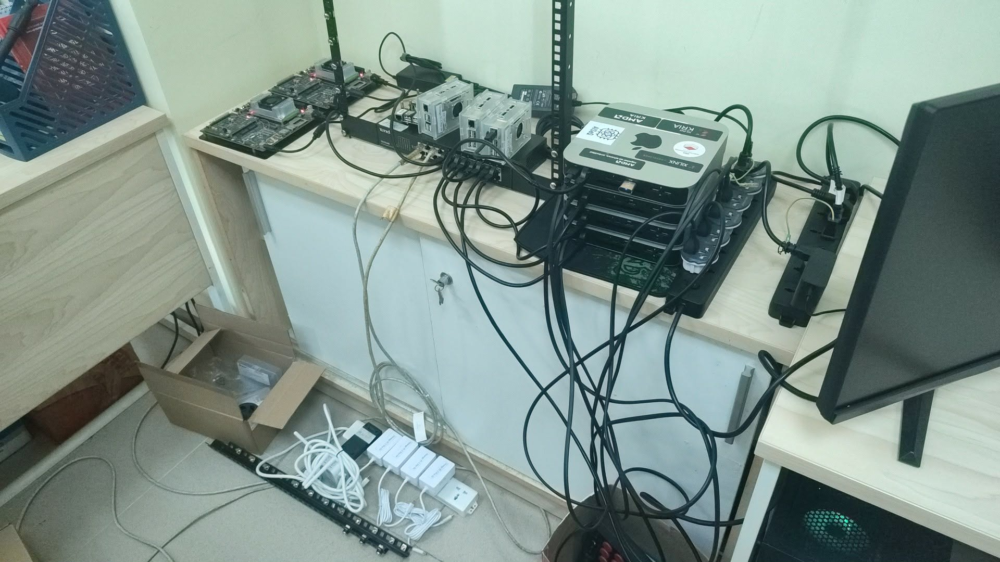

Ý định ban đầu là làm quả 10-inch mini-rack như thế này, chỉ tầm 10-12U.

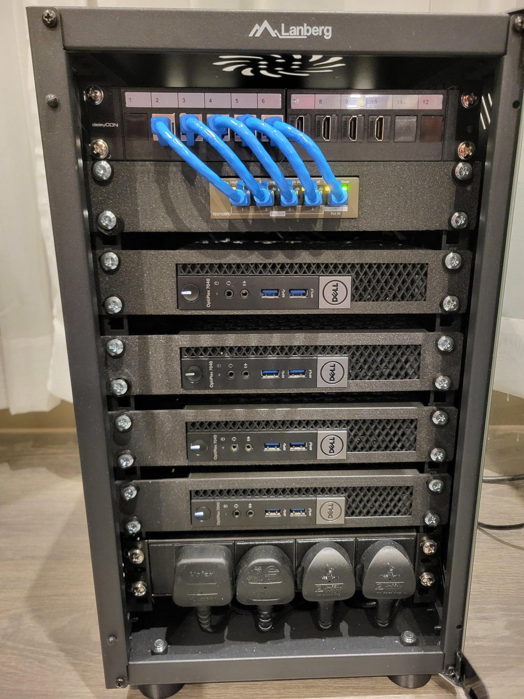

Nhưng sau khi tham khảo nguyên liệu thì nguyên quả khung đã làm tôi khóc thét. Có hai option, một là in 3D toàn bộ (nhưng tôi nghĩ là nó không gánh nổi tải), hai là mua đồ có sẵn của Deskpi Rackmate, nhưng nhìn quả này xem.

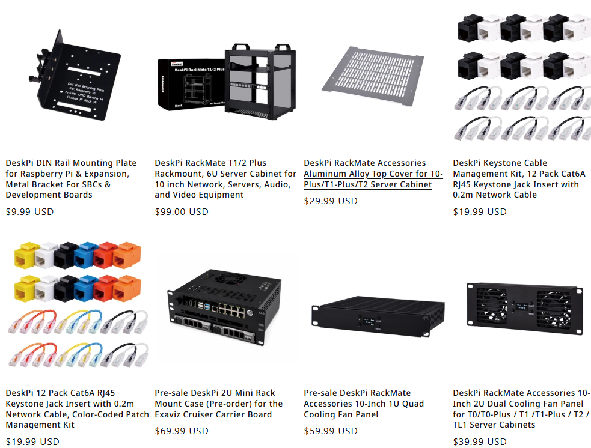

Nguyên khung lỏ 6U đã có giá 100$, không những thế ở VN không có phân phối chính hãng, phải thông qua xách tay nên giá có thể bị đội lên 20-30%, option này quá là không kinh tế.

Do đó, tôi đã lên kế hoạch để biến từ một đống sắt vụn thành khung rack. Tất cả nguyên vật liệu đều được mua trên sàn cam.

### 1. Khung

Để chế mini-rack tiết kiệm nhất thì mình chọn loại open-rack, nôm na là không có thêm lớp bên ngoài để chống bụi, mà chỉ trơ chọi khung.

Tôi thích phương án này: sử dụng nhôm định hình 2020 để làm khung (12 thanh), sau đó bắt thanh V lỗ để làm khung phụ bên trong, tuy nhiên giá nhôm khá đắt, nên để cắt giảm thêm nữa tôi chỉ dùng 4 thanh V lỗ (vì lần đầu làm nên tôi chọn kích thước vừa vừa là 12U, project kế thì có thể chọn dài hơn).

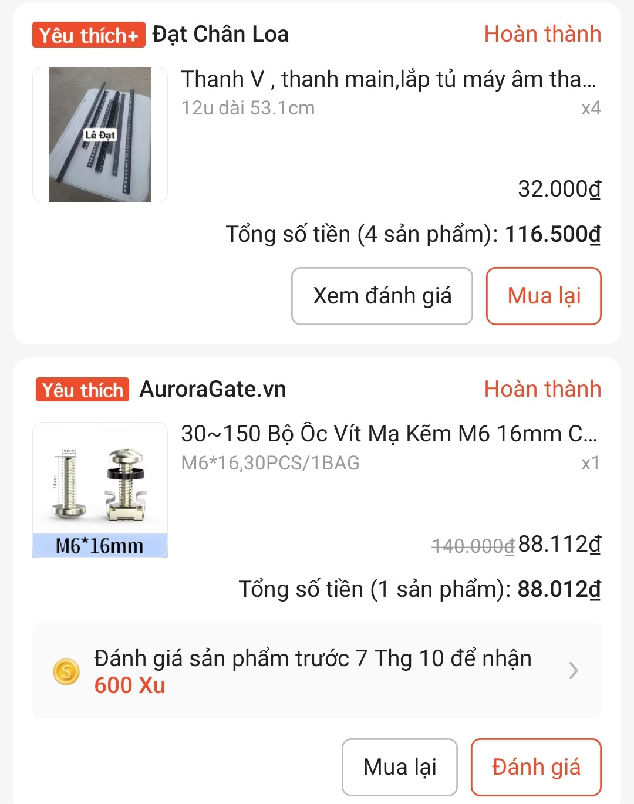

Thanh V lỗ này (2 x 2) sẽ có một mặt full lỗ vuông để bắt ecu M6 và một mặt lỗ tròn M6 nhưng thưa hơn, chúng ta sẽ có mặt lỗ vuông hướng chính diện và lỗ tròn cạnh bên.

Để cố định thì có nhiều option, tôi sử dụng mâm trên dưới. Mâm tôi mua có D400 mm, cái này hơi thiếu kinh nghiệm vì xài mâm cùng Depth thì tầng trên sẽ không liên thông tới tầng dưới được. Tốt hơn thì nên xài thanh ngang trước.

Ngoài ra tôi mua thêm ở shop này mấy panel để giằng trước sau.

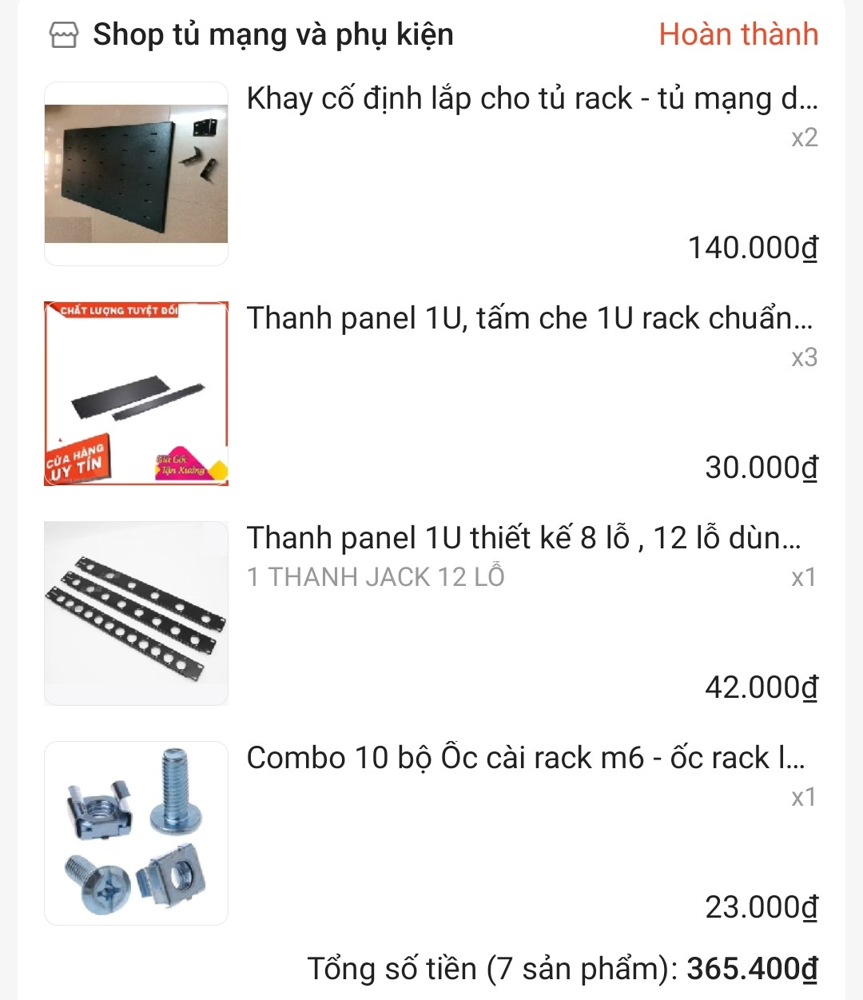

Sau khi sử dụng 4 thanh V, 3 mâm và một số panel thành quả sẽ như thế này. Hình này là tôi đang ướm thử các thiết bị lên xem để hkông gian chứa không.

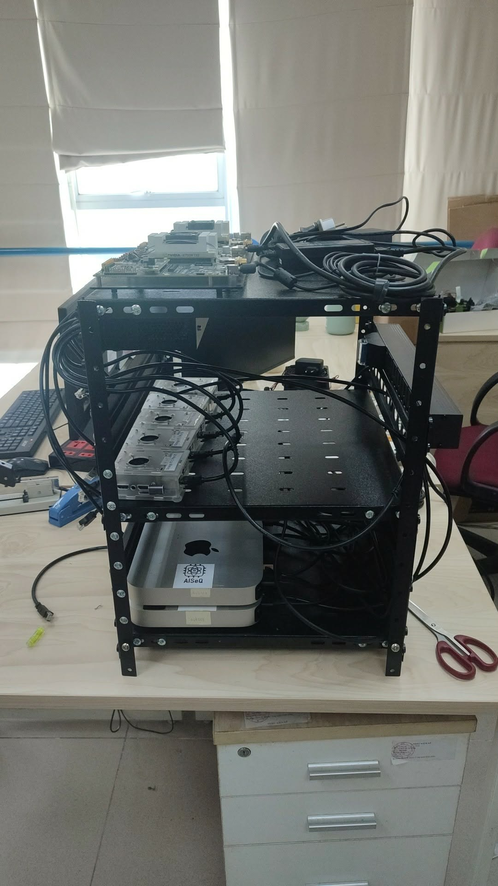

### 2. Nguồn

Phần kế là nguồn, sau khi tìm hiểu một thời gian thì tôi chọn thanh PDU này, giá thành và công năng vừa phải, các bác lưu ý phần công suất và CB. 

Tuy nhiên PDU này khá ít ổ cắm nên tôi độ thêm 3 cái ổ điện 6 lỗ DELI. Tổng dây out chỉ có 1, dĩ nhiên là các bác có thể mua PDU có số ổ cắm nhiều hơn, tuy nhiên P/P sẽ thấp hơn so với kiểu này.

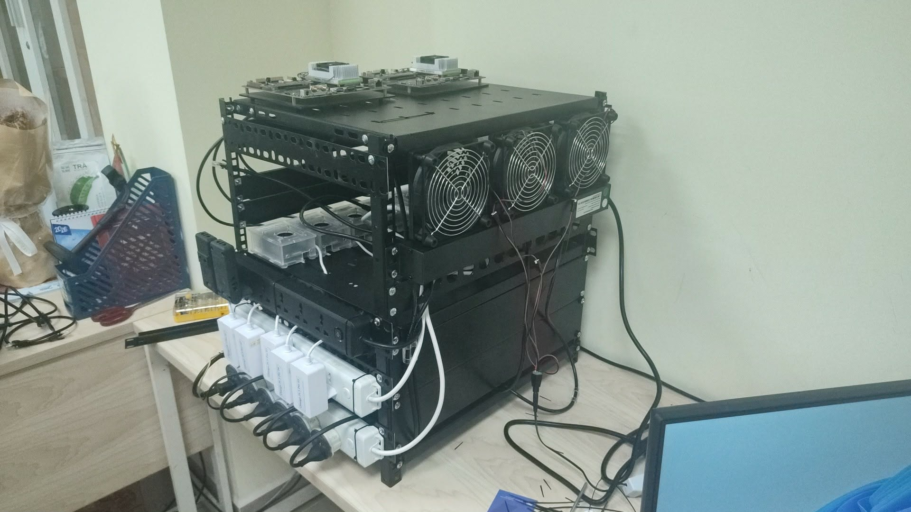

PDU có tai bắt nên sẽ được gắn vào mặt sau (hoặc hông cũng được), còn 3 ổ cắm thì tôi quyết định để vào mặt hông để dễ đi dây, nhưng lúc sau đổi lại thành mặt sau luôn.

Để dây không bị cong khi gấp đoạn thì các bác có thể mua mấy connector như thế này. Vì đầu con Pi của tôi vuông góc, nên nếu cứ đấu dây nguồn vào thì không xếp gọn gần nhau được (xếp chồng thì quạt top trên pi lại bị che).

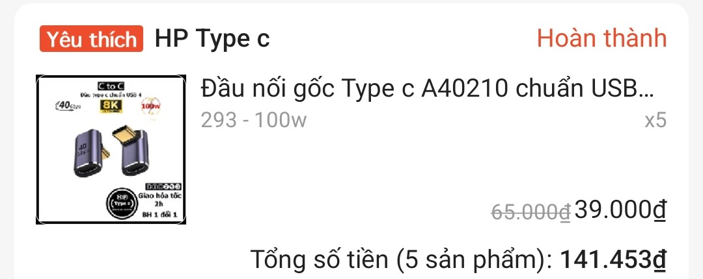

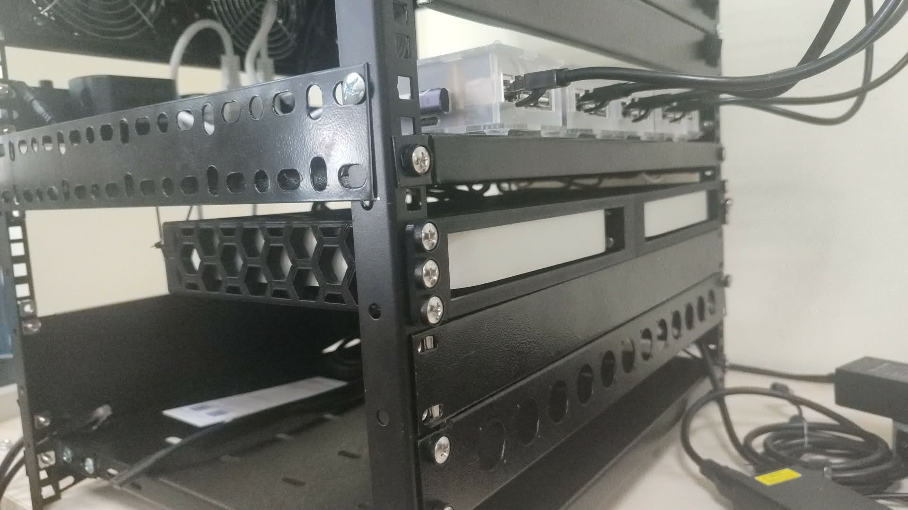

Đi dây nguồn (+ dây mạng) là một nghệ thuật, lý tưởng nhất là ta đi dây dọc theo khung (khung sẽ giấu dây dùm), dây đi vào không gian trong tủ rack sẽ phải là minimum về length. 

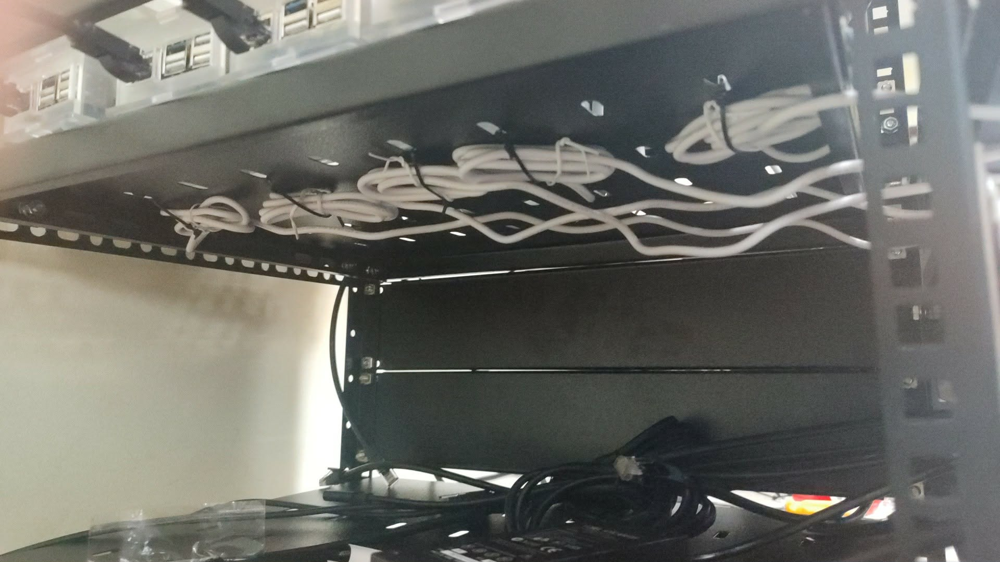

Một vấn đề ae hay gặp phải khi đi dây nguồn là dây quá dài, phải uống cong thành một bó lớn, nếu dây dài quá ae có thể cân nhắc đấu nối lại.

### 3. Tản nhiệt

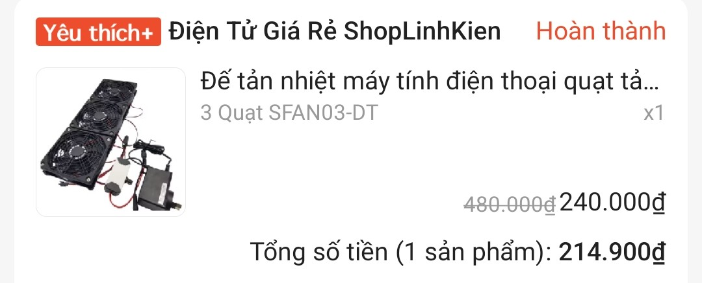

Vì giá mâm kết hợp quạt tản nhiệt bot hoặc top quá đắt (kèm nhiều chức năng) nên tôi quyết định tự build hệ thống quạt 12x12 2800 RPM, bao gồm 3 quạt mặt trước (ở dưới) và 3 quạt mặt sau (ở trên). 2 cụm này đều có nút điều tốc riêng (hiện tại thủ công). Tuy nhiên để mount lên rack thì cần phải có panel được in 3D. File in [tại đây](https://www.printables.com/model/1289687-19-3u-server-rack-fan-panel-remix-straight-edges) (giá in khoảng 120k), ae nhớ chọn nhựa PETG cho cứng cáp.

Thành quả sau khi đi dây một chút sẽ như thế này. AE phải lưu ý thêm về hướng thổi và khí động học trong rack, không khí nên đi theo chiều từ dưới lên trên, lạnh đi vào và nóng đi ra, khi nóng tự bốc lên trên nên quạt thổi ra sẽ được ở trên.

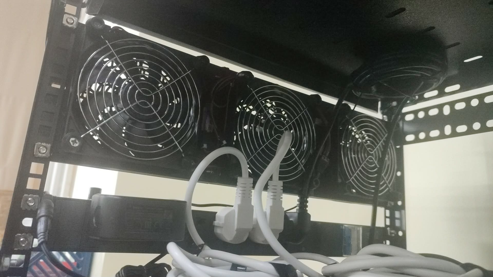

### 4. Thành giằng ngang

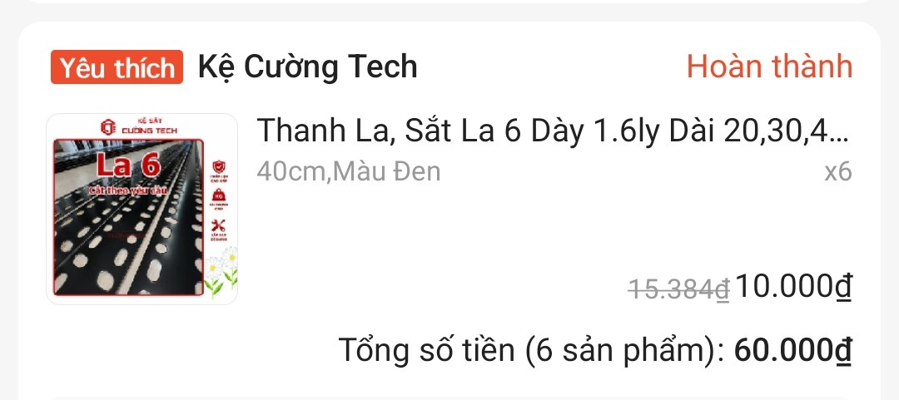

Để tiết kiệm chi phí ở mức tối đa thì thay vì đặt riêng một tấm panel sắt bắt mặt hông, anh em có thể ke những thanh la đục nhiều lỗ như thế này để gia cố (nếu không rack sẽ dễ bị đẩy trước-sau).

Mặc dù đã đo kích thước kĩ càng nhưng nhận được về thanh la vẫn bị dư một chút & cắt không thẳng nữa :))) Đúng là của rẻ của ôi. Tuy nhiên 2 thanh giằng này phải neo vào nhau thông qua một tấm mica vuông.

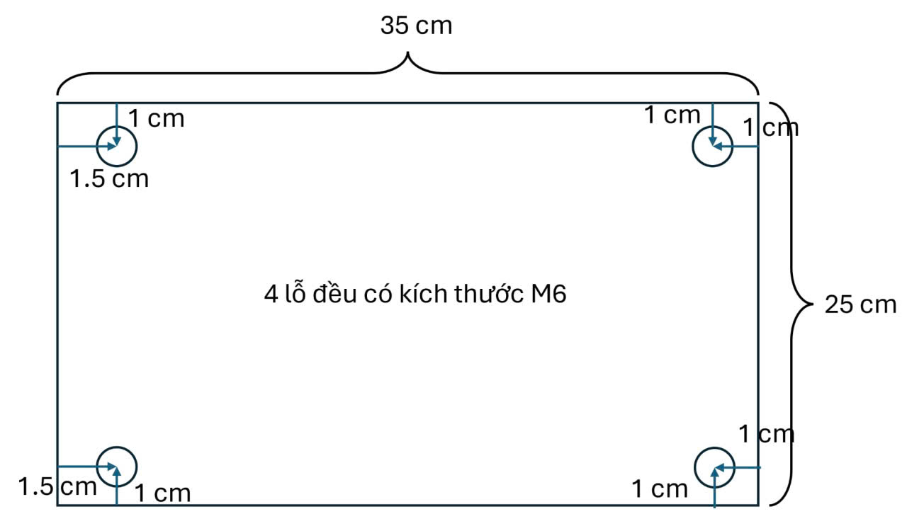

Giá khá rẻ và có shop cắt theo yêu cầu, tuy nhiên lần đầu nhận được hàng thì bị hụt =)) May mắn đặt lần 2 shop đã bù cho cái cũ.

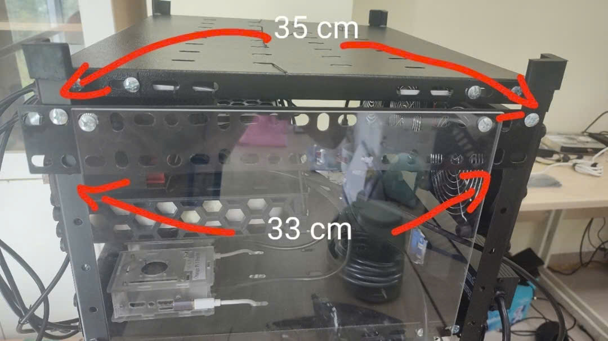

Lúc này coi như phần khung đã siêu chắc chắn.

### 5. Ánh sáng

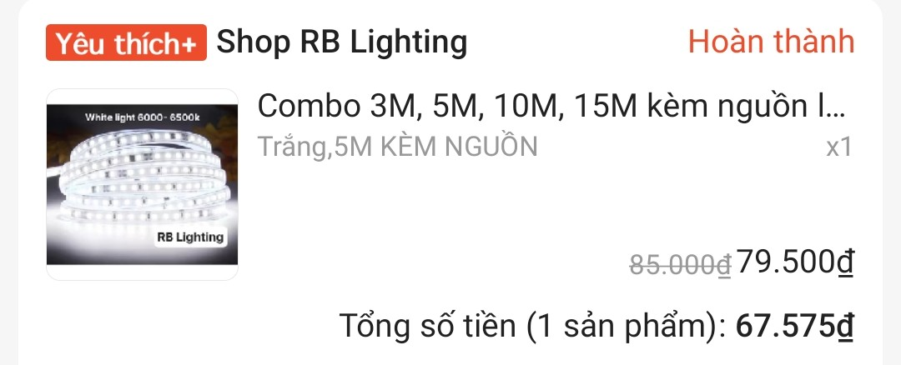

Phần led thì đơn giản là mua LED trắng 220V về gắn ở trên rãnh, ae cũng không cần quan tâm độ dài vì chúng ta có thể cắt và đấu nối đầu nhận điện thêm một lần nữa từ đoạn cắt. 

### 6. Network

Khá đơn giản vì trong phòng tôi đã setup sẵn net và chỉ cần đấu nối vào switch thì tất cả các thiết bị trong rack có thể kết nối được với nhau.

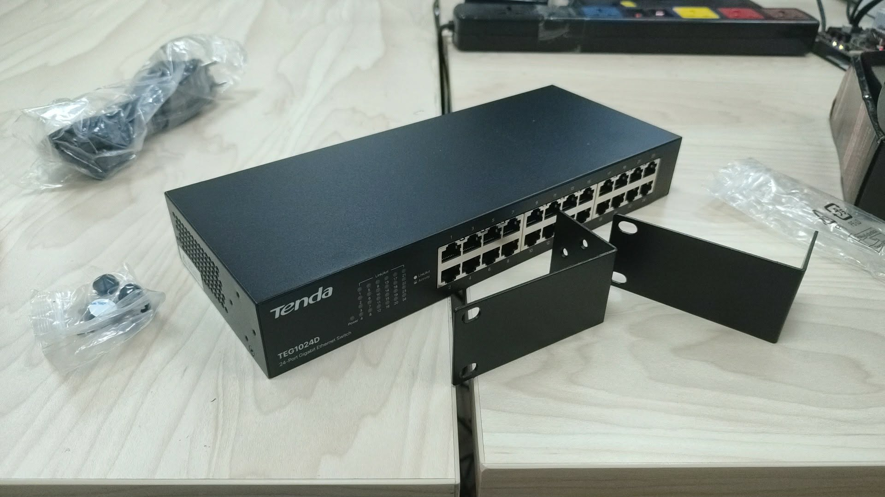

Ước tính là tôi sẽ còn > 18 port nên tôi quất lên con new Tenda 24 port 1Gbps này với giá hơn 700k (săn sale). Thật sự thì những con 48 port thì quá dư thừa, còn những switch cao cấp 10 Gbps hay có hỗ trợ Poe thì quá mất nên tôi cũng bỏ qua. Về vị trí thì ae nên đặt ở top để tiện đi dây

Có switch thì phải có dây mạnh, patch panel, rồi keystone, đây là khoảng tốn kém nhất của tôi.

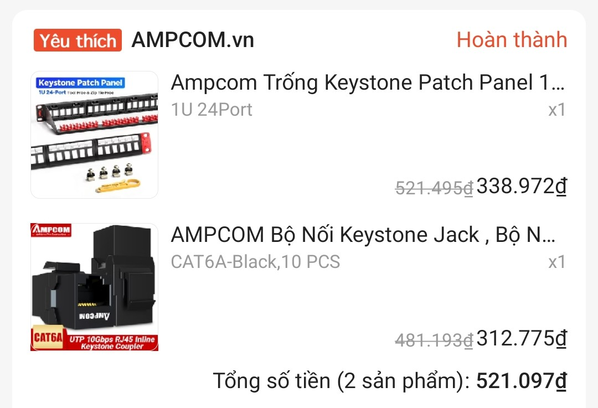

Đây đều là hàng mới, nhưng rút kinh nghiệm thì mọi người có thể mua patchpanel trống cũ cũng được, Keystone thì nên mua mới, tôi prefer lại inline hơn vì đấu nối nhanh chóng và gọn gàng. Dây mạng thì ae nên chọn CAT6 trở lên, thầy GPT thì bảo CAT7,8 không cần thiết vì băng thông nội bộ cũng vậy nên tôi chỉ mua thêm một cọng CAT6A nối dài.

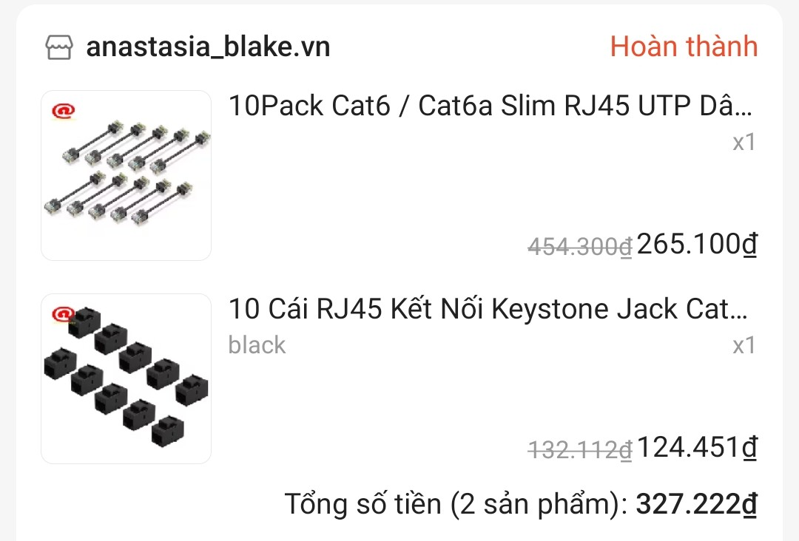

Để đấu từ switch vào patch panel thì ae nên mua loại dây slim như thế này, dễ uốn, thẩm mỹ cao, dây UTP khi uống rất cứng, có khả năng bị gãy đứt tại đầu bấm rắc.

### 7. Phụ kiện trang trí

Đầu tiên là 2 cái tay cầm để có thể xách quả rack này đi tung tăng

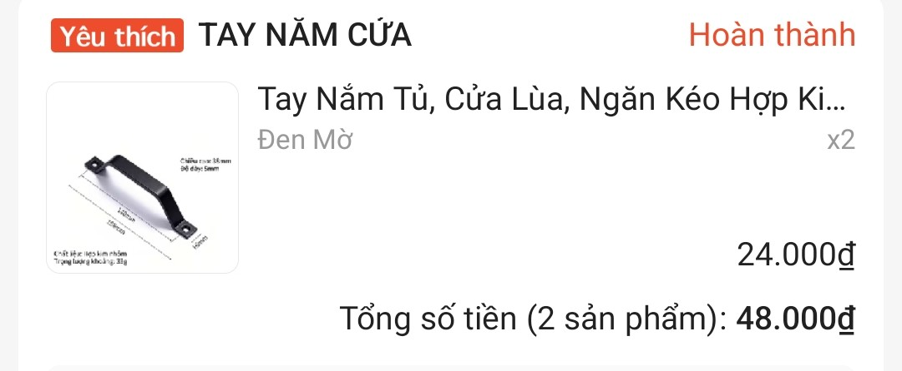

Mn nhớ đi thật kỹ kích thước giữa 2 lỗ để xem thử mâm trên có thể lắp vô luôn được không, nếu không phải khoan lỗ, như tôi thì đã đo đạc kĩ nên vừa, tuy nhiên loại này không có lỗ M6 nên tôi đành mua lỗ M4 và chơi đai ốc vào bên dưới để siết hơn.

Vì Touch screen cho minirack quá mắc nên tôi chơi hẳn portable screen luôn, hiện thị sắc nét và có loa nữa (cũng có touch nên vì hết tiền nên tôi phải chọn loại 16inch rẻ nhất là VSP).

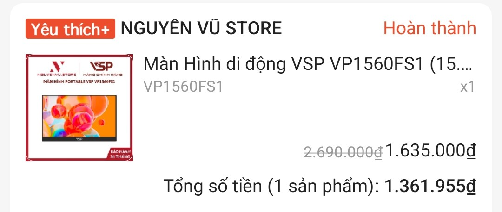

Tôi lấy một con mac mini m1 làm host, phụ trách port hình và chạy một vibe-code screen hiển thị dashboard của tủ rack.

Trong tủ rack khá chặt, không thể gắn arm nên tôi chơi phương án này

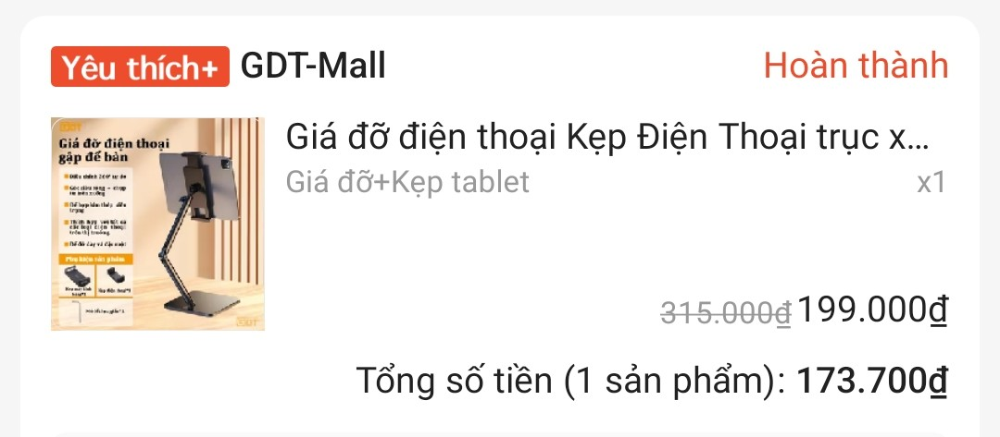

Và neo tay từ top xuống dưới.

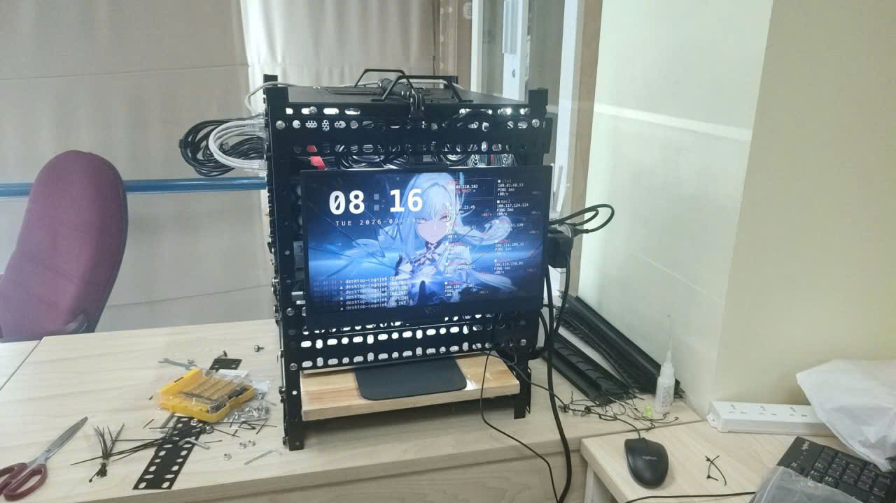

Dĩ nhiên có màn hình thì phải có thêm bàn phím, chuột, tôi tận dụng lại con RK71 3 năm trước và chuột logitech rách làm device. Một bàn gỗ và thanh ray trượt được gắn vào 1/2 mâm dưới

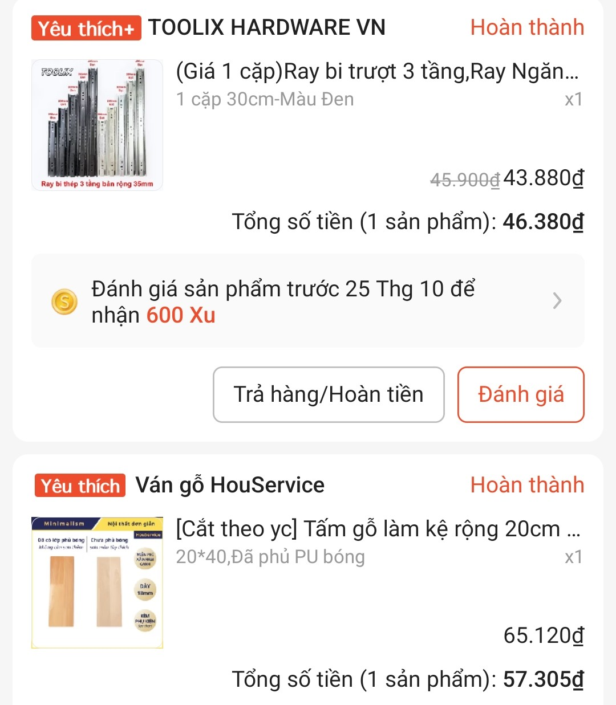

Đây là option hạt dẻ nhất mà tôi có thể kiếm được, nếu tấm gỗ kia có shop làm màu tối như gỗ óc chó thì sẽ tốt hơn.

Một vài món mua lẻ tẻ khác ví dụ như ốc, dây cáp, băng keo, velcro, dây rút, ...

### 8. Tổng ngân sách

| STT | Tên hàng                                        | Danh mục        | SL | Thành tiền (VNĐ) |
|----:|-------------------------------------------------|-----------------|---:|-----------------:|
| 1   | Switch Tenda TEG1024D                           | Máy tính        | 1  | 776,000          |
| 2   | Cáp mạng Cat6 UTP Ugreen 0.5m (x10)             | Phụ kiện        | 1  | 231,000          |
| 3   | Thẻ nhớ MicroSD                                 | Phụ kiện        | 1  | 189,000          |
| 4   | PDU 19 inch 4000W                               | Phụ kiện        | 1  | 340,000          |
| 5   | Nguyên liệu làm tủ rack                         | Nguyên liệu thô | 1  | 435,000          |
| 6   | Cáp USB 3.0 to USB 3.0                          | Phụ kiện        | 1  | 68,000           |
| 7   | Quạt 12x12 cm (x3)                              | Nguyên liệu thô | 1  | 215,000          |
| 8   | Cáp mạng Cat6 UTP 1m (x9)                       | Phụ kiện        | 1  | 239,000          |
| 9   | Nguyên liệu làm tủ rack                         | Nguyên liệu thô | 1  | 425,000          |
| 10  | Đầu nối góc USB Type-C                          | Phụ kiện        | 5  | 141,000          |
| 11  | In 3D                                           | Nguyên liệu thô | 1  | 504,000          |
| 12  | Ốc vít                                          | Nguyên liệu thô | 1  | 74,000           |
| 13  | Patch panel + 10 keystone inline + 10 dây nhảy  | Nguyên liệu thô | 1  | 736,000          |
| 14  | Phụ kiện bổ sung                                | Nguyên liệu thô | 1  | 200,000          |
| 15  | In 3D                                           | Nguyên liệu thô | 1  | 504,000          |
| 16  | Đèn LED                                         | Nguyên liệu thô | 1  | 67,000           |
| 17  | Phụ kiện bổ sung                                | Nguyên liệu thô | –  | 180,000          |
| 18  | Ổ chia điện Deli                                | Phụ kiện        | 1  | 110,000          |
| 19  | In 3D (bổ sung)                                 | Nguyên liệu thô | 1  | 294,000          |
| 20  | Thanh la 6 (x6)                                 | Nguyên liệu thô | 1  | 57,000           |
| 21  | Thanh panel 1U 12 lỗ                            | Nguyên liệu thô | 3  | 181,000          |
| 22  | Phụ kiện bổ sung                                | Nguyên liệu thô | 1  | 694,000          |
| 23  | Ổ điện Deli                                     | Phụ kiện        | 2  | 367,000          |
| 24  | Băng keo đen                                    | Văn phòng phẩm  | 1  | 39,000           |
| 25  | Ốc vít                                          | Nguyên liệu thô | 1  | 193,000          |
| 26  | Quạt hút (x3)                                   | Nguyên liệu thô | 1  | 192,000          |
| 27  | Tay nắm                                         | Nguyên liệu thô | 2  | 48,000           |
| 28  | In 3D case quạt                                 | Nguyên liệu thô | 1  | 114,000          |
| 29  | Tấm mica hông                                   | Nguyên liệu thô | –  | 60,000           |
| 30  | Băng dán Velcro                                 | Nguyên liệu thô | 3  | 62,000           |
| 31  | Ván cắt kê bàn phím                             | Nguyên liệu thô | 1  | 57,000           |
| 32  | Ray trượt bi (1 cặp)                            | Nguyên liệu thô | 1  | 46,000           |
| 33  | Màn hình di động VSP                            | Màn hình        | 1  | 1,361,000        |
| 34  | Giá đỡ màn hình                                 | Phụ kiện        | 1  | 173,000          |
| 35  | Dây nhảy mạng                                   | Phụ kiện        | 6  | 85,000           |
| 36  | Ốc vít                                          | Nguyên liệu thô | –  | 53,000           |
| 37  | Cáp USB Type-C to Type-C                        | Phụ kiện        | 1  | 95,000           |
| 38  | In nổi logo AISeQ                               | Nguyên liệu thô | 4  | 120,000          |
| 39  | Cáp USB Type-C to Type-A                        | Phụ kiện        | 1  | 58,000           |
|     | **TỔNG CỘNG**                                   |                 |    | **9,783,000 đ**   |

Tada, và đây là thành quả cuối cùng, hoạt động ổn định trong phòng không có máy lạnh.

- Kích thước: 19inch x 12U x 400 mmm
- Cân nặng: ~40 kg
- Thiết bị tính toán: 4 Mac Mini M1 8GB 512GB, 5 Orange PI 5 Pro 16GB 64GB, 2 Jetson TX2 và một số board mạch khác.
- Tổng tiêu thụ điện: ~200 W
- Network: 1Gbps
- Ngoại vi: màn hình FullHD 16 inch (có loa lỏ), bàn phím cơ 2 mode, chuột có dây.

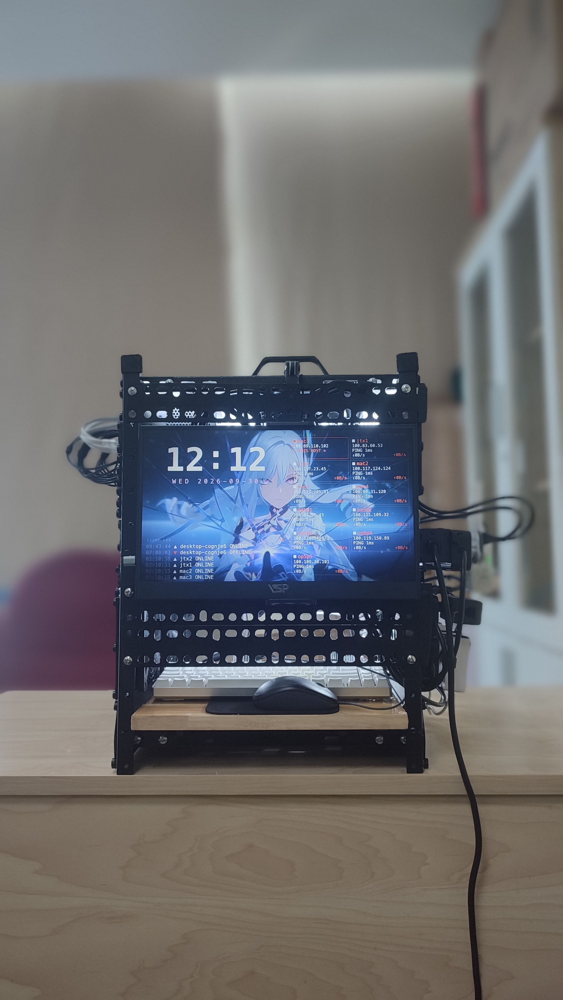

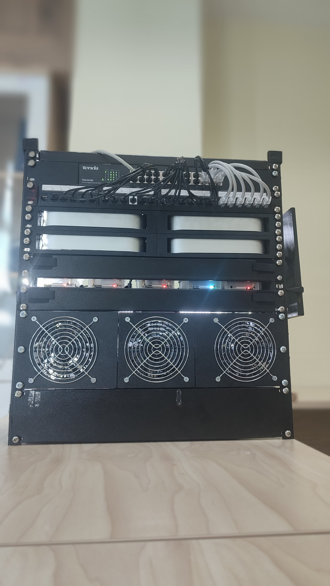

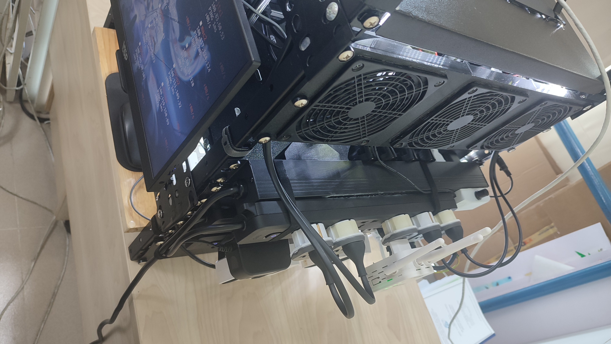

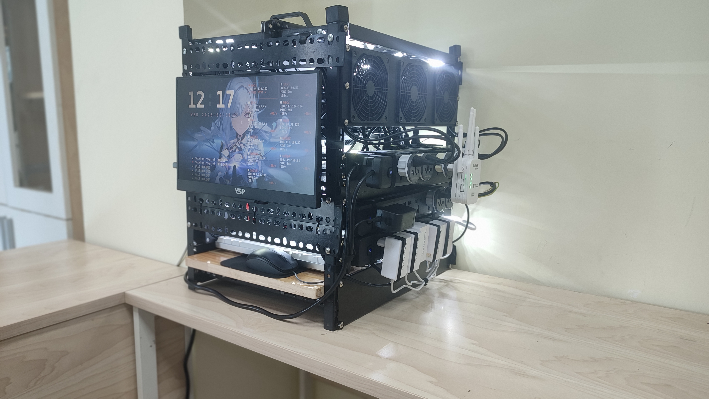

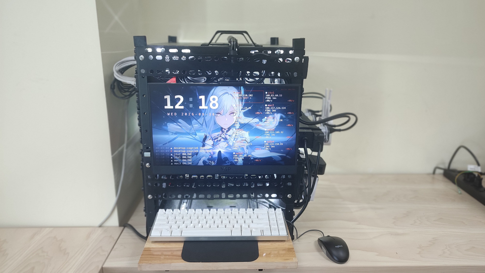

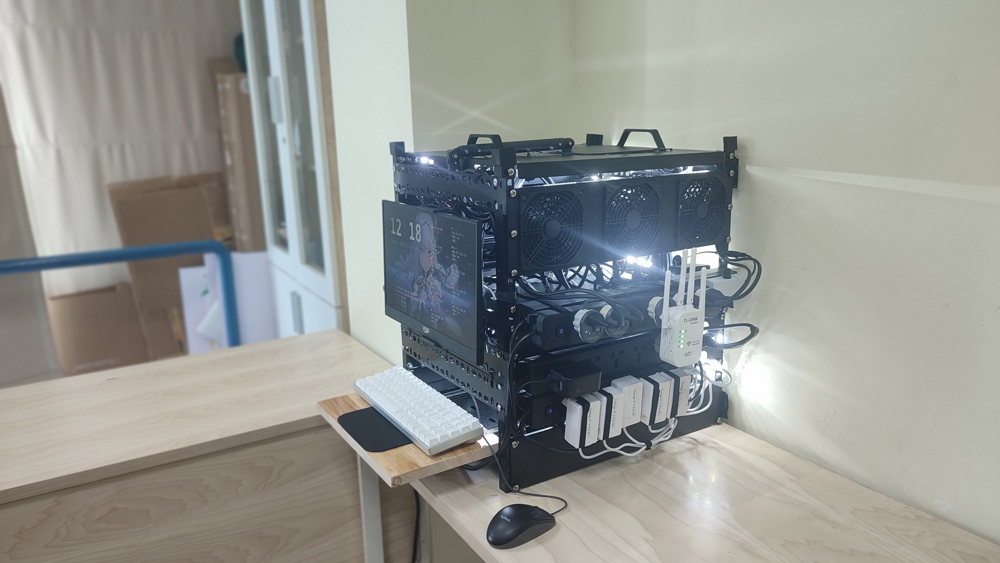

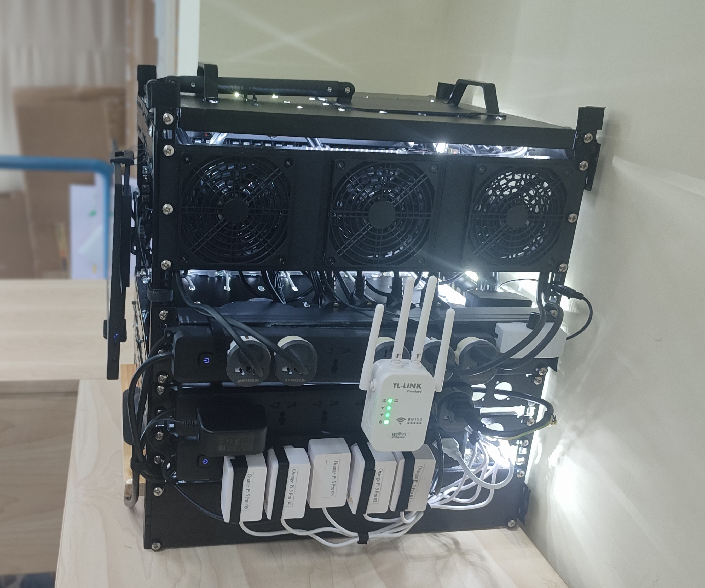

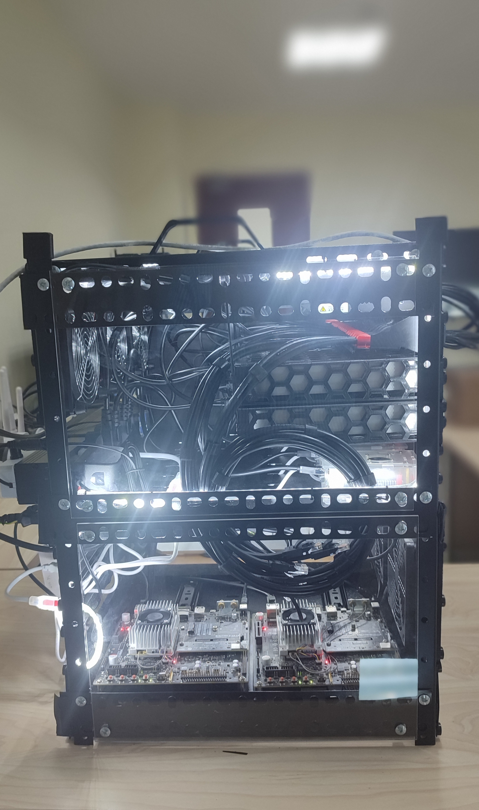
