# Demo

### [6] Post-quantum cryptography accelerator

We accelerated Kyber, SPHINCS+ (FALCON in progress) [[link1]](https://ieeexplore.ieee.org/abstract/document/10762592/) [[link2]](https://ieeexplore.ieee.org/abstract/document/10818323).

    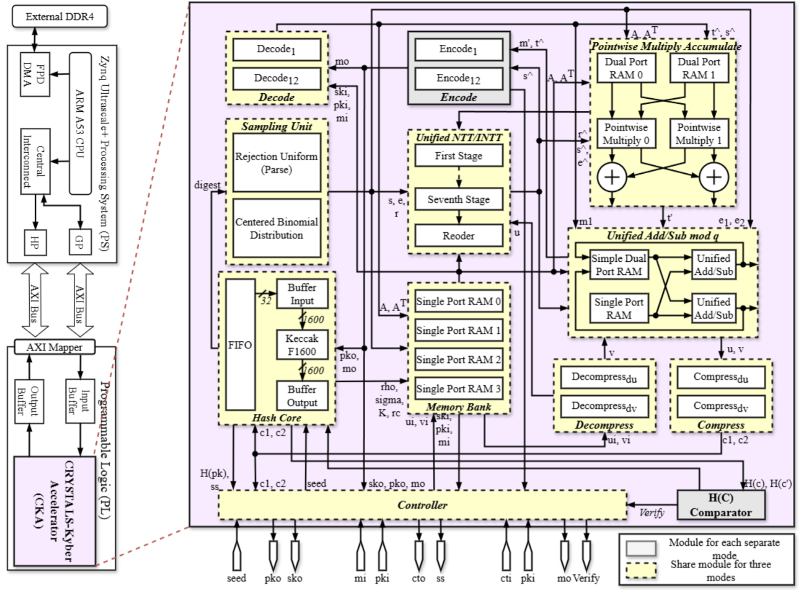

*Figure 6.1.  Kyber accelerator archtecture.*

    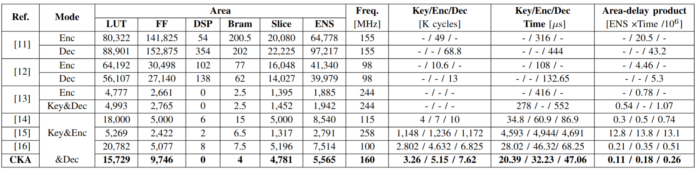

*Figure 6.2. Hardware implementation evaluation and comparisons.*

    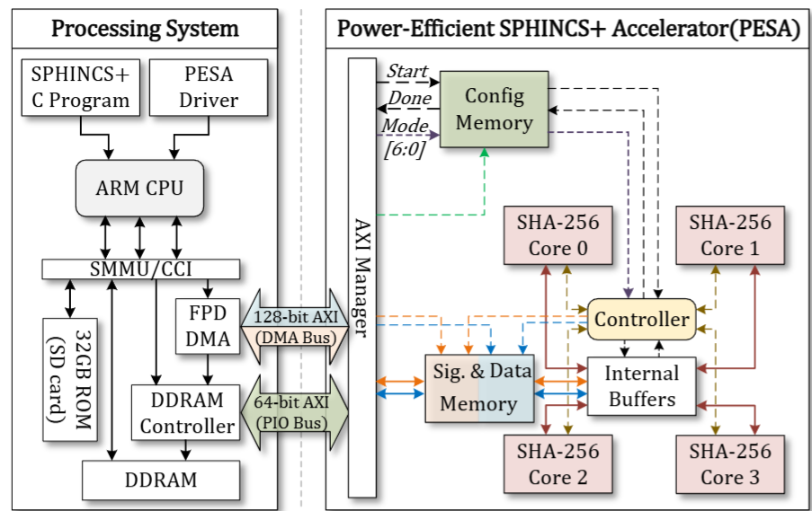

*Figure 6.3.  SPHINCS+ accelerator archtecture.*

    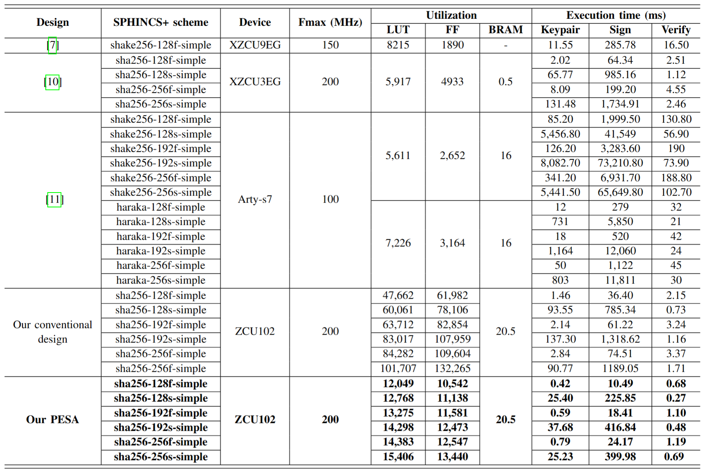

*Figure 6.4. Hardware implementation evaluation and comparisons.*

Check the [video demo](https://youtu.be/fhlUopZPaIo) for more information:

<iframe width="100%" height = "400px" src="https://youtu.be/fhlUopZPaIo" title="YouTube video player" frameborder="0" allow="accelerometer; autoplay; clipboard-write; encrypted-media; gyroscope; picture-in-picture; web-share" referrerpolicy="strict-origin-when-cross-origin" allowfullscreen></iframe>

### [5] Lane detection accelerator for auto-car

This accelerator can achieved up to 640 FPS [[code]](https://github.com/AISeQLab/DEMO_Lane_detection).

    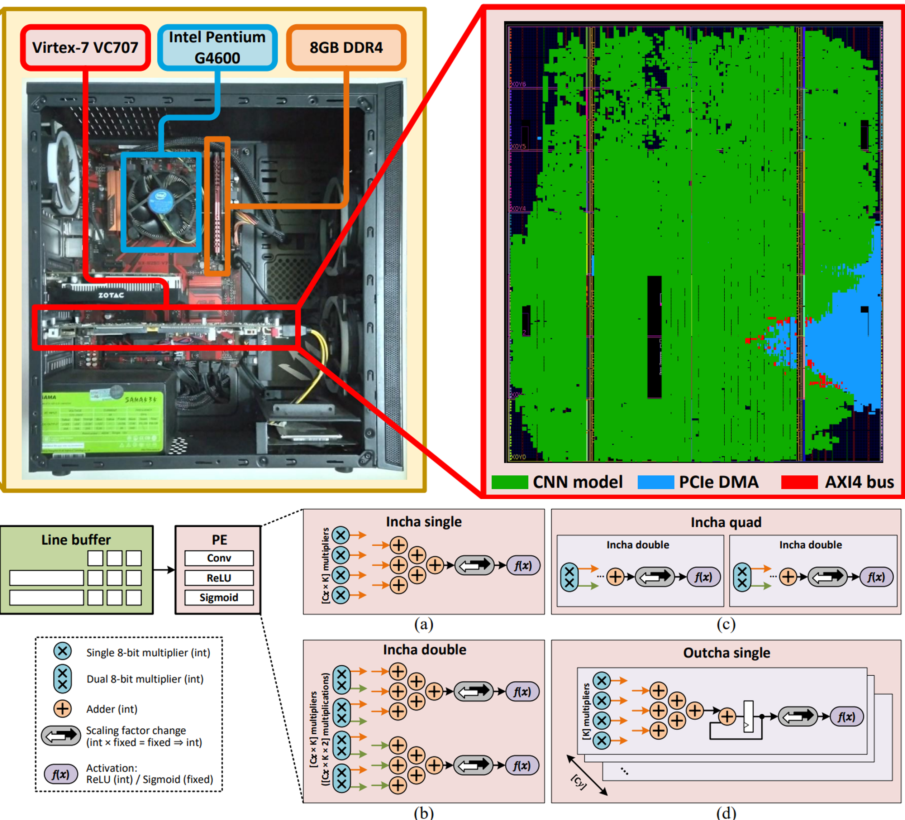

*Figure 5.1.  Full system operation, including results captured on monitor, and Floorplan of the FPGA chip.*

    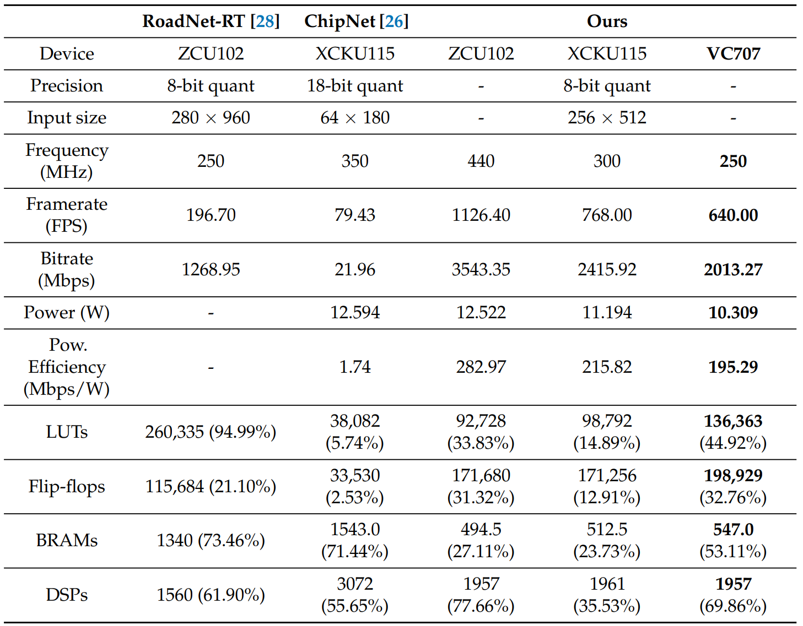

*Figure 5.2. Hardware implementation evaluation and comparisons.*

Check the [video demo](https://youtu.be/4vqoZCGZGPE?si=4NCV5FmQ0AnW1kYp) for more information:

<iframe width="100%" height = "400px" src="https://www.youtube.com/embed/s4mEMaoAnUQ?si=5zOeOAqy11-_Iy2u" title="YouTube video player" frameborder="0" allow="accelerometer; autoplay; clipboard-write; encrypted-media; gyroscope; picture-in-picture; web-share" referrerpolicy="strict-origin-when-cross-origin" allowfullscreen></iframe>

### [4] CRGA for cryptography

We apply CRGA architecture for various popular cryptography

Scientific paper (pre-print): [[link1]](https://ieeexplore.ieee.org/abstract/document/10758927) [[pdf1]](https://drive.google.com/file/d/1QgYaYuwlEJFQ9OAL-s9kYXVQ69jqBn3e/view?usp=sharing) [[link2]](https://ieeexplore.ieee.org/document/10742119) [[pdf2]](https://drive.google.com/file/d/1_TnI1uSGR5uAWWQ7JYtlh1DvaKyNzCGj/view?usp=sharing) 
[[link3]](https://ieeexplore.ieee.org/document/10620019) [[pdf3]](https://drive.google.com/file/d/1RZxsol6_UdISXvSo_zSzZkHJnmeZlenl/view?usp=sharing) [[code]](https://github.com/AISeQLab/Demo_CGRA)

    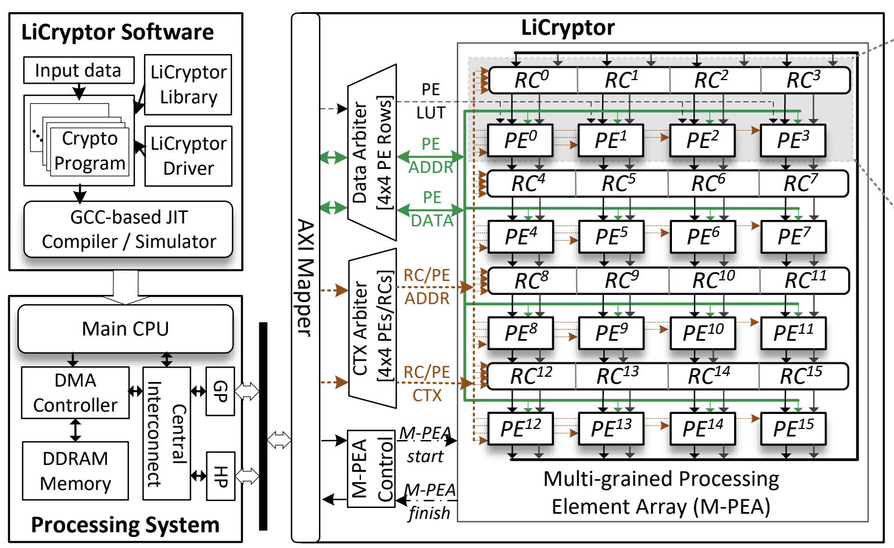

*Figure 4.1. LiCryptor overview architecture at the SoC level.*

    

*Figure 4.2. Execution times of our LiCryptor and two powerful CPUs for 64-bit, 32-bit, and 8-bit LWC algorithms.*

Check the [video demo](https://youtu.be/4vqoZCGZGPE?si=4NCV5FmQ0AnW1kYp) for more information:

<iframe width="100%" height = "400px"  src="https://www.youtube.com/embed/4vqoZCGZGPE?si=v7RVCqP3Mxv-Vof8" title="YouTube video player" frameborder="0" allow="accelerometer; autoplay; clipboard-write; encrypted-media; gyroscope; picture-in-picture; web-share" referrerpolicy="strict-origin-when-cross-origin" allowfullscreen></iframe>

### [3] Qimax: A parallel stabilizer formalism package

Qimax is a parallel stabilizer pakcage which is used for simulating both Clifford and non-Clifford circuit.

Scientific paper (pre-print): [[link]](https://arxiv.org/abs/2505.03307) [[pdf]](https://arxiv.org/pdf/2505.03307) [[code]](https://github.com/AISeQLab/qimax-soft)

    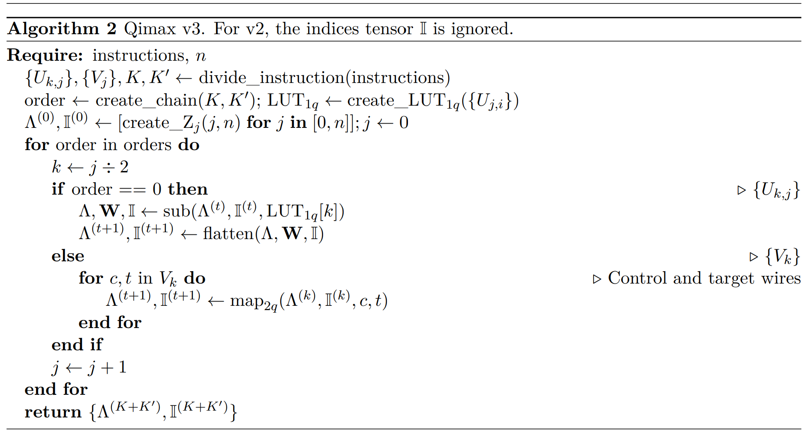

*Figure 3.1. Qimax v3. For v2, the indices tensor I is ignored.*

    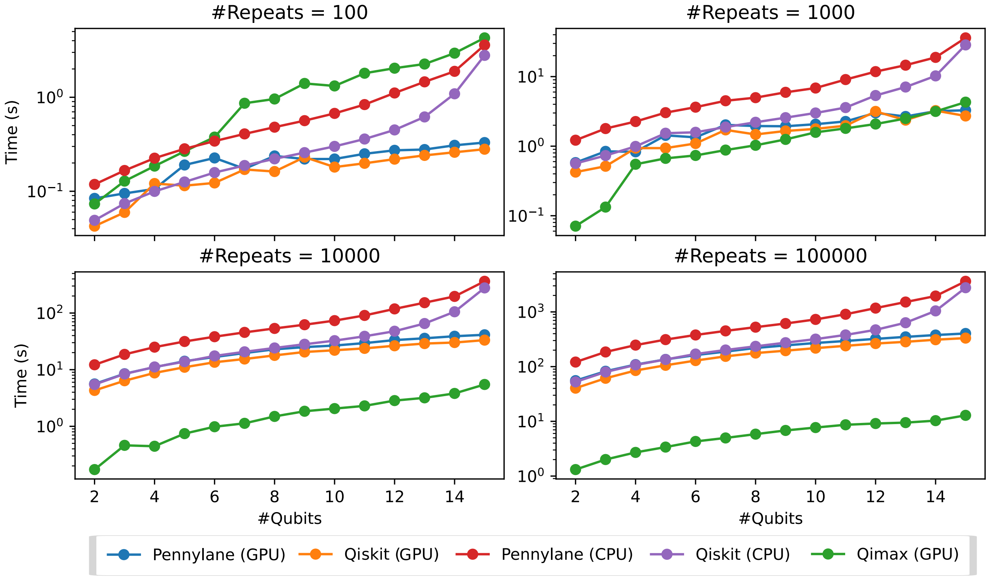

*Figure 3.2. Execution time from different versions of Pennylane, Qiskit, and Qimax. The y-axis is plotted on logarithmic scale. The range of #Qubits is 2 to 15.*

### [2] FQsun: A wave-function based emulator

We use FPGA ZCU102 to emulate a (up to 30 qubits) quantum system, based on state-vector (wave-function variant).

Scientific paper (ACCESS): [[link]](https://ieeexplore.ieee.org/document/11015479/) [[pdf]](https://ieeexplore.ieee.org/stamp/stamp.jsp?tp=&arnumber=11015479) [[code]](https://github.com/AISeQLab/FQsun)

    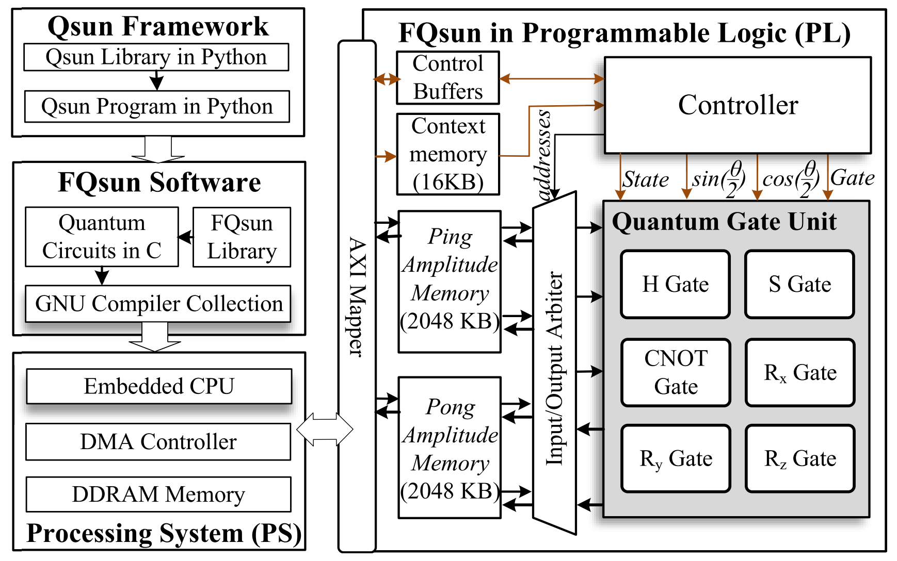

*Figure 2.1. Overview architecture of our FQsun at the system-on-chip (Soc) level on FPGA. The arrow stands for dataflow. FQsun in PL communicates with PS through AXI Mapper and DMA Controller.*

    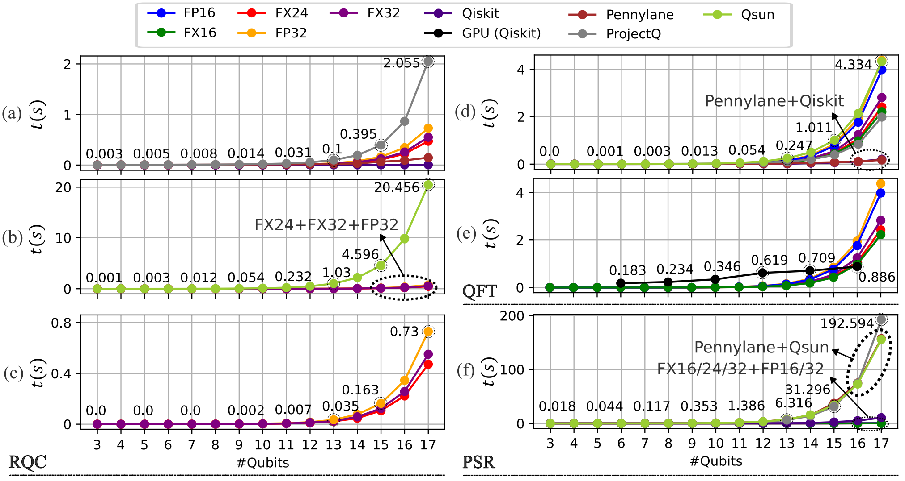

*Figure 2.2. The execution time comparison*

Check the [video demo](https://youtu.be/J6nvTbfzo-0?si=gydMvRN0VzG5fv8w) for more information:

<iframe width="100%" height = "400px" src="https://www.youtube.com/embed/J6nvTbfzo-0?si=9ALTj_U7gvBkTmq5" title="YouTube video player" frameborder="0" allow="accelerometer; autoplay; clipboard-write; encrypted-media; gyroscope; picture-in-picture; web-share" referrerpolicy="strict-origin-when-cross-origin" allowfullscreen></iframe>

### [1] ECG processing for medical application

We propose a 1D-CNN accelerate (MINA) for processing ECG signal series for detecting heart disease. 

Scientific paper (TCAS-I): [[link]](https://ieeexplore.ieee.org/abstract/document/10948469/) [[pdf]](https://drive.google.com/file/d/1bXJ22whhtUEaHsR4Y5SIYyDlCiS9yMy4/view?usp=sharing) [[code]](https://github.com/AISeQLab/DEMO_MINA)

    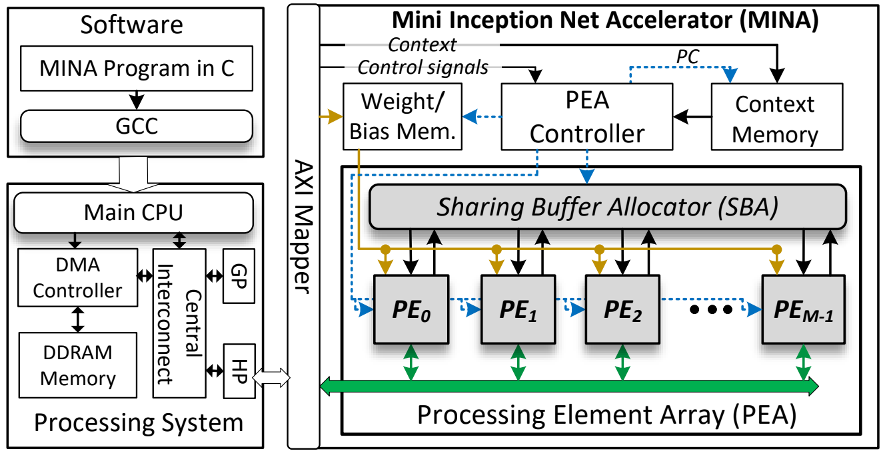

*Figure 1.1. MINA overview architecture*

    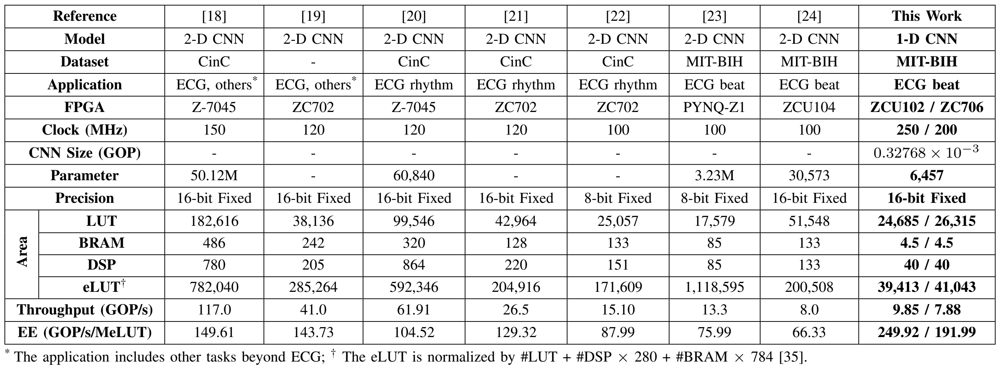

*Figure 1.2. Comparison with fpga-based 2-d cnn hardware architectures for ecg classification.*

Check the [video demo](https://youtu.be/RAKSJXHCnf8?si=DLvXDAGBIEGdkT-t) for more information:

<iframe width="100%" height = "400px" src="https://www.youtube.com/embed/RAKSJXHCnf8?si=eaEJf4_6Dp-5yv0A" title="ECG demo" frameborder="0" allow="accelerometer; autoplay; clipboard-write; encrypted-media; gyroscope; picture-in-picture; web-share" referrerpolicy="strict-origin-when-cross-origin" allowfullscreen></iframe>
