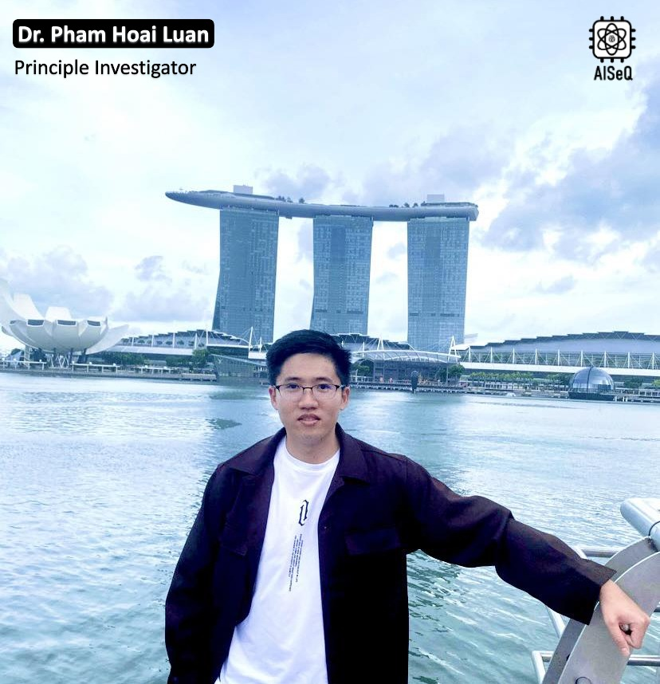

Dr. Pham Hoai Luan is currently an Assistant Professor at NAIST, a Visiting Lecturer at UIT, and a SOC Engineer at LENZO.  
His research interests encompass blockchain technology, cryptography, computer architecture, circuit design, and hardware accelerators. He has published extensively in prestigious IEEE Transactions journals (such as TCAS-I and TCAD) and presented at leading hardware design conferences, including COOLCHIPS, SOCC, ISOCC, and CANDAR.  

Background:

- Assistant Professor, NAIST, 2022 – Present  
- PhD, NAIST, 2020 – 2022  
- MS, NAIST, 2018 – 2020  
- BE, CE-UIT–VNUHCM, 2013 – 2018  

---

Tiến sĩ Phạm Hoài Luân (PI) hiện là Trợ lý Giáo sư (Assistant Professor) tại NAIST, Nhật bản, Giảng viên tại UIT, đồng thời là kỹ sư SOC tại LENZO. Lĩnh vực nghiên cứu của ông bao gồm công nghệ blockchain, kiến trúc máy tính, thiết kế mạch và các bộ gia tốc phần cứng. 

Anh đã công bố nhiều công trình trên các tạp chí IEEE Transactions uy tín (như TCAS-I, TCAD) và tham gia báo cáo tại nhiều hội nghị thiết kế phần cứng, bao gồm COOLCHIPS, SOCC, ISOCC và CANDAR.

Quá trình học tập & công tác:

- Trợ lý Giáo sư, NAIST, 2022 – nay
- Tiến sĩ, NAIST, 2020 – 2022
- Thạc sĩ, NAIST, 2018 – 2020
- Đại học: CE-UIT – ĐHQG TP.HCM, 2013 – 2018

