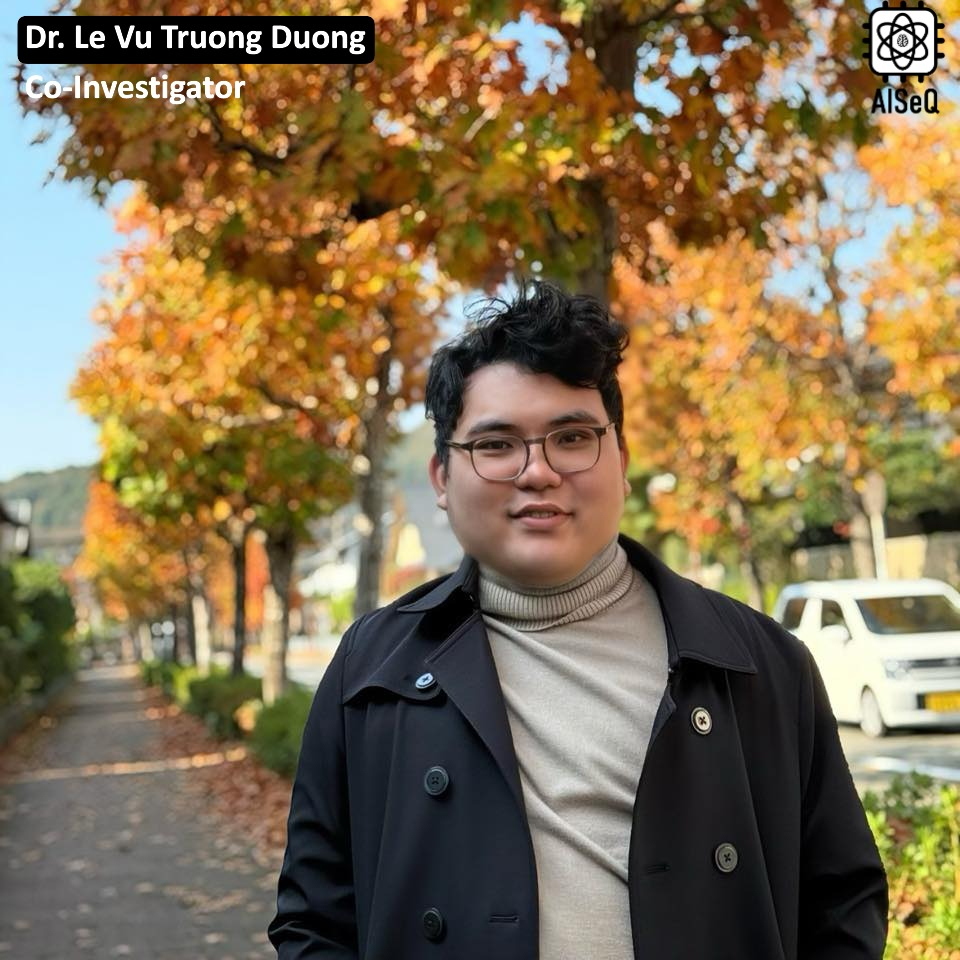

Dr. Le Vu Trung Duong received his Ph.D. degree in 2024 and is currently an Assistant Professor at the Nara Institute of Science and Technology (NAIST).  His research interests include computing architecture, reconfigurable processors, and accelerator design for cryptographic function acceleration.
He has published numerous works in IEEE/IEICE Transactions (TCAS, TCAD) and presented at various conferences such as COOLCHIPS, CANDAR, SOICT, and ATC, among others.  

Background:

- Visiting Lecturer, CE-UIT-VNUHCM, Oct. 2024 – Present  
- Assistant Professor, NAIST, Oct. 2024 – Present  
- PhD, NAIST, Apr. 2022 – Sept. 2024  
- MS, NAIST, Oct. 2020 – Mar. 2022  
- BE, Computer Engineering, CE-UIT-VNUHCM, Sept. 2015 – Jun. 2020  

--- 

Tiến sĩ Lê Vũ Trùng Dương nhận bằng Tiến sĩ vào năm 2024 và là Trợ lý Giáo sư tại tại Viện Khoa học và Công nghệ Nara (NAIST). Lĩnh vực nghiên cứu bao gồm kiến trúc tính toán, bộ xử lý khả tái cấu hình, và thiết kế bộ gia tốc cho bộ tăng tốc các hàm trong mật mã học. Anh đã công bố nhiều công trình trên các tạp chí IEEE/IEICE Transactions (TCAS, TCAD) và tham gia báo cáo tại nhiều hội nghị như COOLCHIPS, CANDAR, SOICT, ATC, …

Quá trình học tập & công tác:
- Giảng viên thỉnh giảng, CE-UIT-VNUHCM, 10/2024 – nay
- Trợ lý Giáo sư, NAIST, 10/2024 – nay
- Tiến sĩ, NAIST, 04/2022 – 09/2024
- Thạc sĩ, NAIST, 10/2020 – 03/2022
- Đại học, CE-UIT-VNUHCM,, 09/2015 – 06/2020

