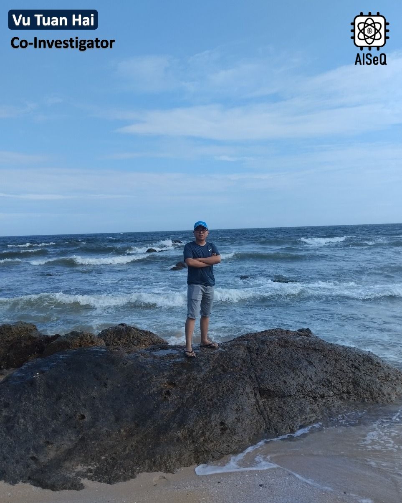

**Vu Tuan Hai** (*Co-Investigator*) is currently a Ph.D. student at the Nara Institute of Science and Technology (NAIST), Japan.  
His research interests include **acceleration of quantum system simulators** and **quantum algorithm development**.  
He has published several works in IEEE and Springer Nature journals, as well as IEEE conferences.  

Academic Background & Professional Experience:

- **Lecturer**, SE-UIT-VNUHCM, *Dec. 2021 – Mar. 2024*  
- **Ph.D. Student**, NAIST, *Apr. 2024 – Present*  
- **M.S., Computer Science**, CS-UIT-VNUHCM, *Feb. 2022 – Aug. 2023*  
- **B.Eng., Software Engineering**, SE-UIT-VNUHCM, *Sept. 2017 – Jun. 2021*  

---

Vũ Tuấn Hải (Co-Investigator) hiện đang là nghiên cứu sinh tại NAIST, Nhật Bản. Lĩnh vực nghiên cứu bao gồm gia tốc các bộ mô phỏng hệ lượng tử và phát triển thuật toán lượng tử. Anh có một số công bố trên các tạp chí IEEE/Spring Nature và hội nghị IEEE.

Quá trình học tập & công tác:

- Giảng viên, SE-UIT-VNUHCM, 12/2021 – 03/2024
- Nghiên cứu sinh, NAIST, 04/2024 – nay
- Thạc sĩ, CS-UIT-VNUHCM, 2/2022 – 08/2023
- Đại học, SE-UIT-VNUHCM,, 09/2017 – 06/2021

<iframe src="https://docs.google.com/presentation/d/e/2PACX-1vRCY40QacEl_EEo5pu1QOxqX0aUjukh0ws56o3El0mAQ72AMBoG3EKyQ4mGNeZFfA/pubembed?start=true&loop=true&delayms=3000" frameborder="0" width="100%" height="749" allowfullscreen="true" mozallowfullscreen="true" webkitallowfullscreen="true"></iframe>