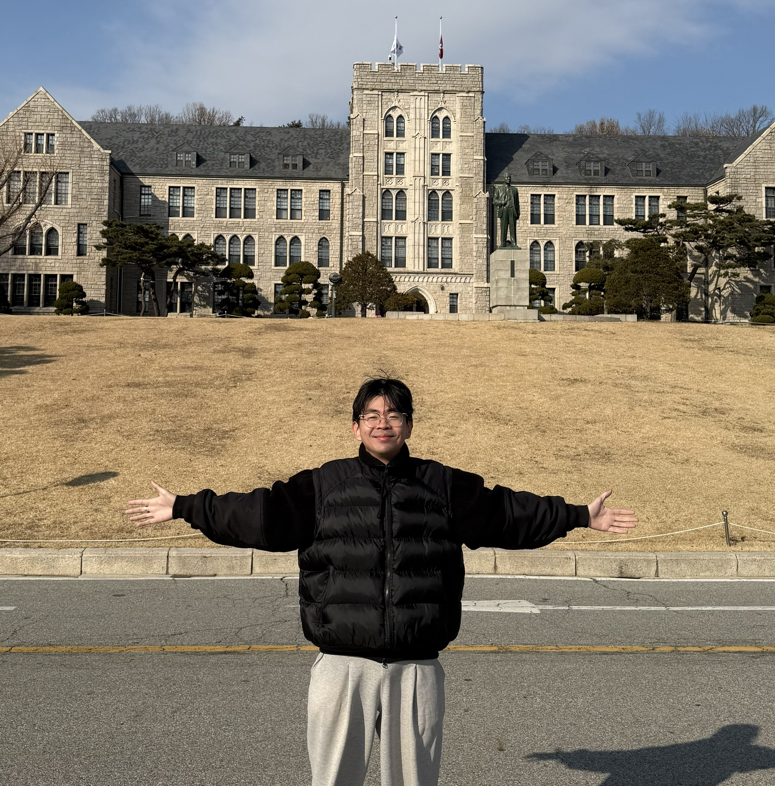

ThS. Bùi Cao Doanh tốt nghiệp Thạc sĩ Kỹ thuật Điện - Điện tử và Máy tính tại Đại học Korea, Seoul, Hàn Quốc vào năm 2025. Hướng nghiên cứu của Doanh tập trung vào học sâu (deep learning) và thị giác máy tính, đặc biệt là các bài toán kết hợp thị giác - ngôn ngữ ứng dụng trong bệnh lý số và bệnh lý tính toán. Các công trình nghiên cứu của Doanh đã được công bố trên nhiều tạp chí quốc tế như IEEE Transactions on Medical Imaging (TMI), Computer Methods and Programs in Biomedicine (CMPB), IEEE Transactions on Circuits and Systems for Video Technology (TCSVT), cũng như tại các hội nghị đặc thù như MICCAI, WACV, AAAI và ACCV. Ngoài ra, Doanh còn tham gia phản biện khoa học cho các tạp chí/hội nghị như TMI, TCSVT, CMPB, IEEE Transactions on Network Science and Engineering, AAAI.

