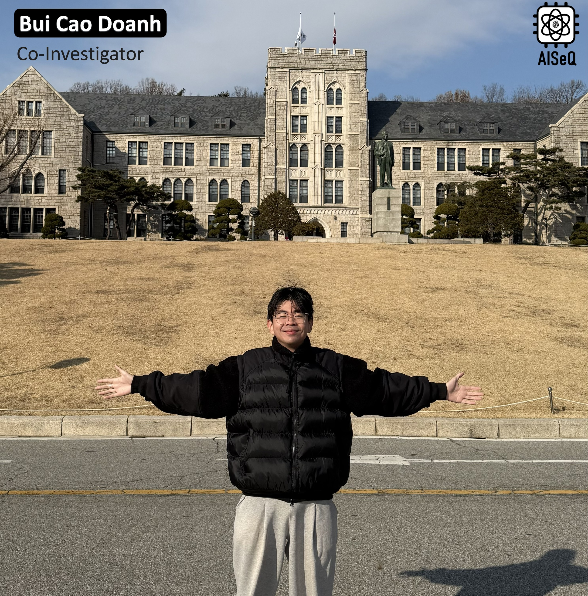

**Bui Cao Doanh** is currently a Ph.D. student at the Nara Institute of Science and Technology (NAIST), Japan. His research focuses on **deep learning** and **computer vision**, particularly in vision-language integration tasks applied to **digital pathology** and **computational pathology**.  

Doanh's research has been published in leading international journals such as *IEEE Transactions on Medical Imaging (TMI)*, *Computer Methods and Programs in Biomedicine (CMPB)*, and *IEEE Transactions on Circuits and Systems for Video Technology (TCSVT)*, as well as in top-tier conferences including *MICCAI*, *WACV*, *AAAI*, and *ACCV*.  

He also serves as a reviewer for journals and conferences such as *TMI*, *TCSVT*, *CMPB*, *IEEE Transactions on Network Science and Engineering*, and *AAAI*.  

Academic Background & Professional Experience:

- **Lecturer**, SE-UIT-VNUHCM, *Aug. 2022 – Mar. 2023*  
- **Ph.D. Student**, NAIST, *Apr. 2025 – Present*  
- **M.S.**, Korea University, Seoul, South Korea, *Apr. 2023 – Mar. 2025*  
- **B.S., Computer Science**, CS-UIT-VNUHCM, *Sept. 2019 – Jun. 2022*  
---
Bùi Cao Doanh đang là nghiên cứu sinh tại NAIST, Nhật Bản. Hướng nghiên cứu của Doanh tập trung vào học sâu (deep learning) và thị giác máy tính, đặc biệt là các bài toán kết hợp thị giác - ngôn ngữ ứng dụng trong bệnh lý số và bệnh lý tính toán. Các công trình nghiên cứu của Doanh đã được công bố trên nhiều tạp chí quốc tế như IEEE Transactions on Medical Imaging (TMI), Computer Methods and Programs in Biomedicine (CMPB), IEEE Transactions on Circuits and Systems for Video Technology (TCSVT), cũng như tại các hội nghị đặc thù như MICCAI, WACV, AAAI và ACCV. Ngoài ra, Doanh còn tham gia phản biện khoa học cho các tạp chí/hội nghị như TMI, TCSVT, CMPB, IEEE Transactions on Network Science and Engineering, AAAI.

Quá trình học tập & công tác:
- Giảng viên, SE-UIT-VNUHCM, 8/2022 – 03/2023
- Nghiên cứu sinh, NAIST, 04/2025 – nay
- Thạc sĩ, Đại học Korea, Seoul, Hàn Quốc, 04/2023 – 03/2025
- Đại học, CS-UIT-VNUHCM,, 09/2019 – 06/2022

