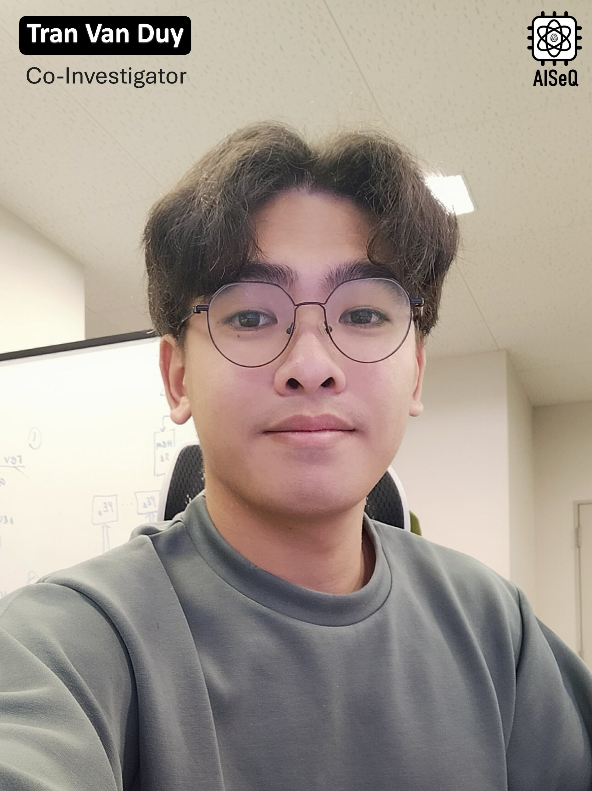

Tran Van Duy received the B.E. degree in IC and hardware design from University of Information Technology, Vietnam National University-Ho Chi Minh City in 2022. He is currently pursuing the master’s degree in information science at Nara Institute of Science and Technology, Japan. His research interests include wireless communication systems, artificial intelligence, cryptography, quantum computing, ASICs, and VLSI design.

