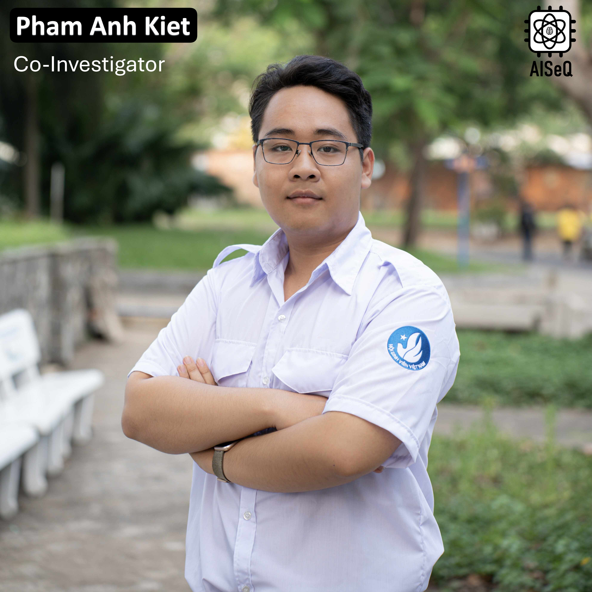

Pham Anh Kiet – currently pursuing a Master’s degree in Information Science at NAIST, Japan. His research interests include hardware accelerators for post-quantum cryptographic algorithms and VLSI design. He has presented at conferences such as CANDAR, SOICT, etc.  

Education:  
- Master’s, NAIST, 10/2025 – present  
- Bachelor’s, CE-UIT-VNUHCM, 09/2021 – 09/2025  

---

Phạm Anh Kiệt – anh hiện đang theo học Thạc sĩ khoa học thông tin tại NAIST, Nhật Bản. Các lĩnh vực nghiên cứu bao gồm bộ tăng tốc phần cứng cho thuật toán mật mã hậu lượng tử, thiết kế VLSI. Tham gia báo cáo tại các hội nghị như CANDAR, SOICT,…

Quá trình học tập & công tác:
- Thạc sĩ, NAIST, 10/2025 – nay
- Đại học, CE-UIT-VNUHCM, 09/2021 – 09/2025

