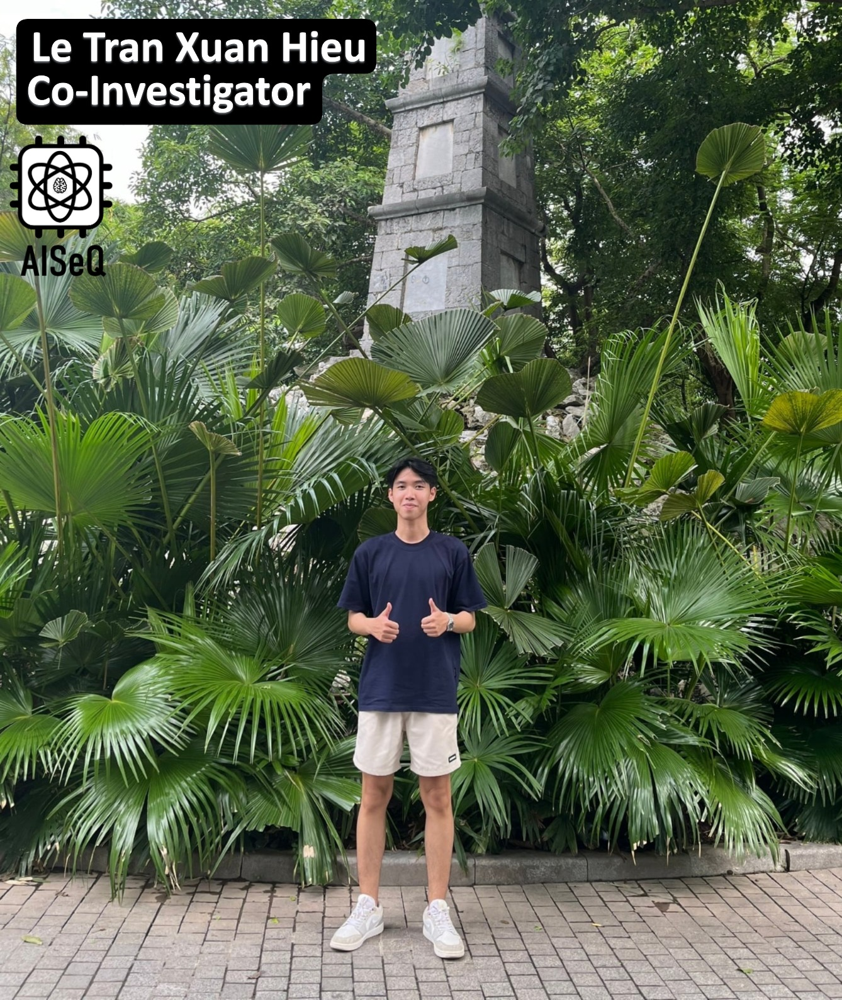

Le Tran Xuan Hieu – currently pursuing a Master’s degree in Information Science at NAIST, Japan. His research interests include hardware accelerators for artificial intelligence algorithms, quantum system simulation, computer architecture, and circuit design. He has presented at conferences such as MCSoC, CANDAR, etc.  

Education & Experience:  
- Master’s, NAIST, 10/2025 – present  
- Bachelor’s, CE-UIT-VNUHCM, 09/2021 – 09/2025  

---

Lê Trần Xuân Hiếu - anh hiện đang theo học Thạc sĩ khoa học thông tin tại NAIST, Nhật Bản. Các lĩnh vực nghiên cứu của anh bao gồm bộ tăng tốc phần cứng cho các thuật toán trí tuệ nhân tạo, mô phỏng hệ lượng tử, kiến trúc máy tính và thiết kế mạch. Anh tham gia báo cáo tại các hội nghị như MCSoC, CANDAR, ...

Quá trình học tập & công tác:
- Thạc sĩ, NAIST, 10/2025 – nay
- Đại học, CE-UIT-VNUHCM, 09/2021 – 09/2025

