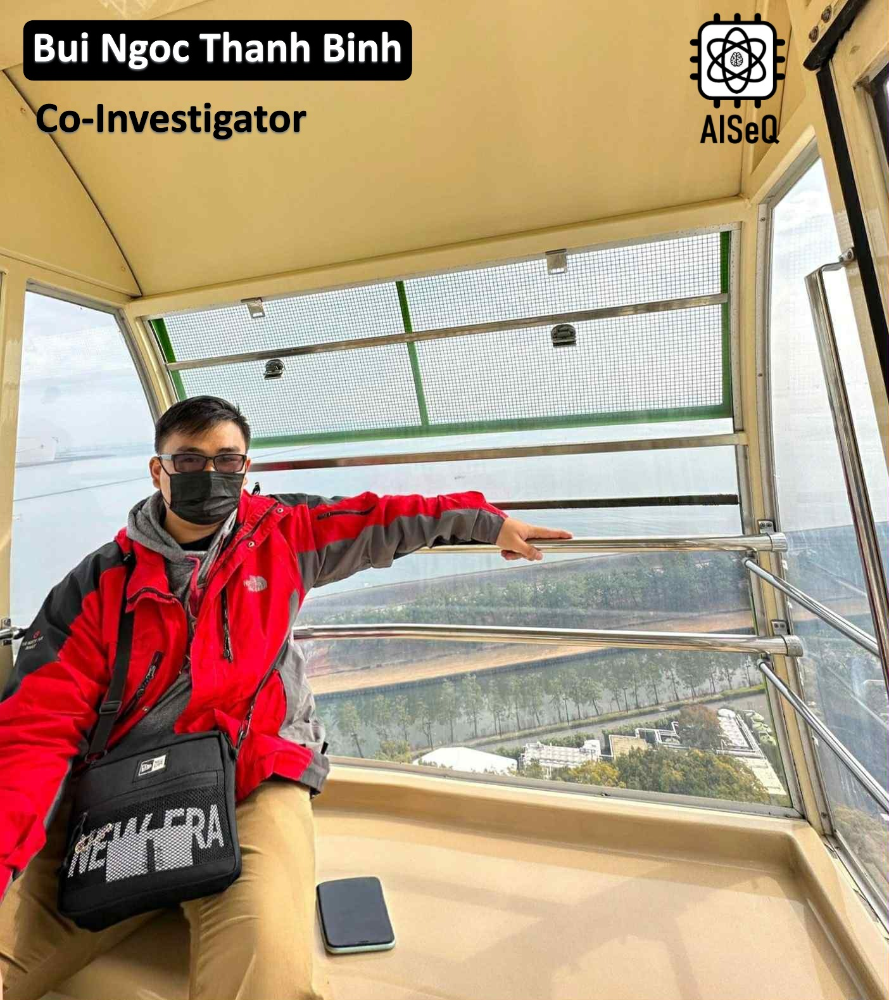

Bui Ngoc Thanh Binh received the Bachelor’s degree in Electronics and Telecommunications Engineering (Advanced Program) from the University of Science, Vietnam National University, Ho Chi Minh City, in 2023. He is currently pursuing the M.S. degree in Information Science at the Nara Institute of Science and Technology, Japan. His research interests include data center network communication systems, programmable networking using P4 in software-defined networks (SDN), artificial intelligence, and hardware design methodologies, including VLSI and ASIC implementations.

Experience and Education:

- Researcher and Assistant, ACLab – CE-HCMUT-VNUHCM: May 2024 – Aug. 2025
- Researcher, ICTLab – FETEL-HCMUS-VNUHCM: Mar. 2023 – Apr. 2024
- Bachelor’s degree, FETEL-HCMUS-VNUHCM: 2019 – 2023

Project:

- Design of network infrastructure and computing servers for the Vietnamese Sign Language project, funded by the Department of Science and Technology of Lam Dong Province.
- Design of network infrastructure for the Ultra Low Power Consumption Blockchain Accelerator for Society 5.0 project, funded by JST (Japan Science and Technology Agency).

---

Bùi Ngọc Thanh Bình nhận bằng Cử nhân Kỹ thuật chuyên ngành Điện tử và Viễn thông (Chương trình Tiên tiến) từ Trường Đại học Khoa học Tự nhiên, Đại học Quốc gia Thành phố Hồ Chí Minh vào năm 2023. Hiện nay, anh đang theo học chương trình Thạc sĩ Khoa học Thông tin tại Viện Khoa học và Công nghệ Nara, Nhật Bản. Các lĩnh vực quan tâm nghiên cứu của anh bao gồm hệ thống truyền thông mạng trong trung tâm dữ liệu, mạng điều khiển bằng phần mềm (SDN) với P4, trí tuệ nhân tạo, và các phương pháp thiết kế phần cứng, bao gồm VLSI và ASIC.

Quá trình học tập và công tác:

- Nghiên cứu viên và Trợ lý, ACLab – CE-HCMUT-VNUHCM: 5/2024 – 8/2025
- Nghiên cứu viên, ICTLab – FETEL-HCMUS-VNUHCM: 3/2023 – 4/2024
- Cử nhân, FETEL-HCMUS-VNUHCM: 2019 – 2023

